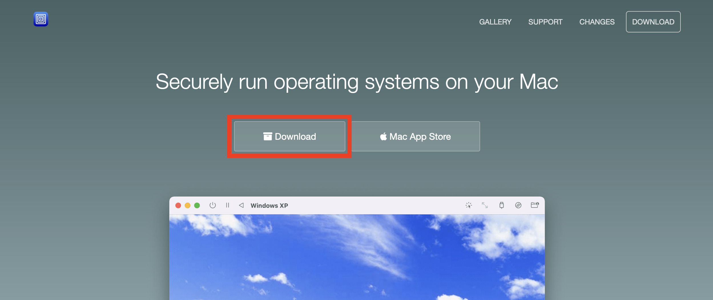
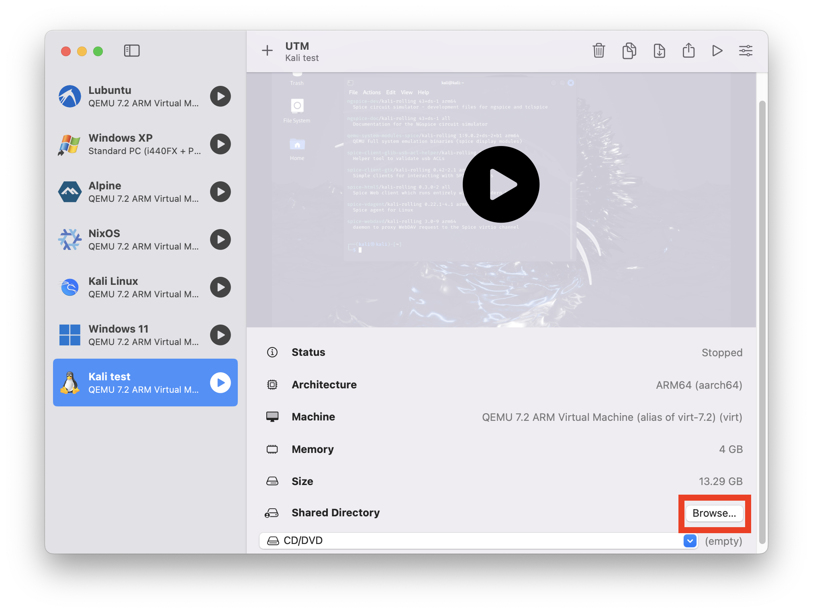

# kali-aarch64-macos
Guide to installing Kali Linux on aarch64 macOS

## Step 1 - Install UTM

Head to the [UTM website](https://mac.getutm.app/) and download the app. It costs $10 to download from the App Store, but is free to download manually.



> UTM is virtual machine software for macOS similar to VirtualBox. It's a wrapper for the open source virtual machine QEMU that makes it easier to use.

Open the DMG file and drag the app into your applications folder.

## Step 2 - Install Kali

Follow [this](https://www.kali.org/docs/virtualization/install-utm-guest-vm/) guide to install Kali in UTM. You can safely use most of the default options in the installer, leaving the "Domain" section blank.

## Step 3 - Install Guest Tools

Make sure to complete the above guide and remove your install media from the virtual machine, otherwise you'll just boot back into the installer!

Next we'll install the SPICE guest tools suite. This will allow you to copy and paste between your computer and the virtual machine as well as enabling auto-resizing of the window.

Open a terminal and enter the following command:

```bash
sudo apt-get install spice-vdagent spice-webdavd
```

> ``spice-vdagent`` is the tool that allows the above described features, ``spice-webdavd`` allows you to transfer files between your virtual machine and your computer.

After the install finishes, shutdown your VM and go back to the main UTM window. If you'd like to be able to transfer files between from your virtual machine, click on your virtual machine's tab in the UTM list and scroll down to "Shared Directory", then browse to the directory you'd like to share.



To access the shared folder in your virtual machine, open the app "Thunar" (file browser) either from the application menu or by clicking the folder icon in the menu bar. On the left sidebar, click "Browse Network" and then double-click the "Spice client folder" to mount your shared folder. It should then appear underneath the "Browse Network" section in the sidebar.

## Step 4 - Setup x86_64 Support

TODO
